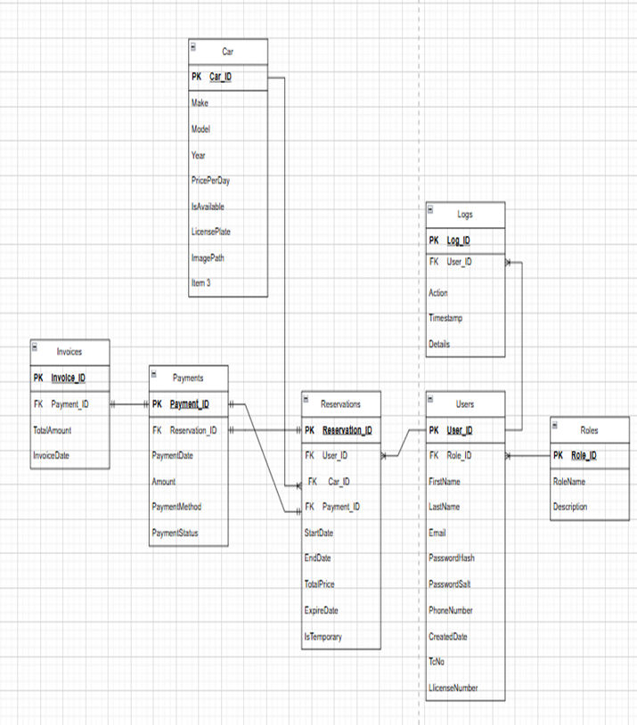

## 🚗 Car Rental API (Back-End) EN
A robust, secure, and scalable RESTful API built with ASP.NET Core (C#), Entity Framework, and PostgreSQL, designed for modern car rental businesses.

This back-end system offers:
- Advanced JWT-based authentication & role-based authorization,
- Comprehensive vehicle, user, and reservation management,
- Efficient handling of real-time bookings and payments,
- Detailed logging and admin controls,
- Secure data storage and high performance.

Easily integrates with the Angular front-end to deliver a seamless and professional car rental experience.

## ✅ Technologies Used
- ASP.NET Core (C#)
- Entity Framework
- PostgreSQL
- JWT Authentication

## ⚙️ Features
- User, vehicle, reservation, and payment management
- Secure login and role-based authorization
- Admin panel endpoints
- Admin logs endpoint

-----------------------------------------------

## 🚗 Car Rental API (Back-End) TR
Modern araç kiralama işletmeleri için ASP.NET Core (C#), Entity Framework ve PostgreSQL ile geliştirilmiş, güvenli ve ölçeklenebilir bir RESTful API.

Bu back-end sistem;
- Gelişmiş JWT tabanlı kimlik doğrulama ve rol bazlı yetkilendirme,
- Kapsamlı araç, kullanıcı ve rezervasyon yönetimi,
- Gerçek zamanlı rezervasyon ve ödeme işlemleri,
- Detaylı loglama ve admin kontrolleri,
- Güvenli veri saklama ve yüksek performans sunar.

Angular tabanlı ön yüz ile kolayca entegre olarak profesyonel bir araç kiralama deneyimi sağlar.

## ✅ Kullanılan Teknolojiler

- ASP.NET Core (C#)
- Entity Framework
- PostgreSQL
- JWT Kimlik Doğrulama

## ⚙️ Özellikler

- Araç, kullanıcı, rezervasyon ve ödeme yönetimi
- Güvenli giriş ve rol tabanlı yetkilendirme
- Admin panel uç noktaları
- Admin log uç noktası

## Database Schema Overview

## Licence

This project is licensed under the MIT License.  
See the [LICENSE](LICENSE) file for more details.

